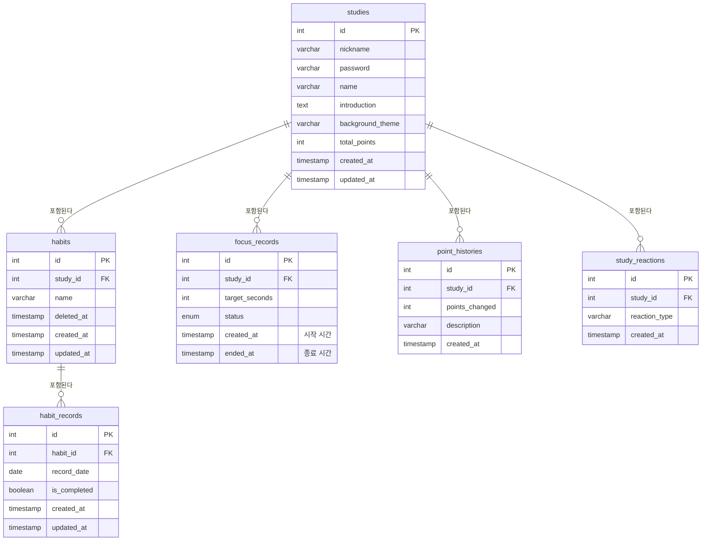

# 공부의 숲 프로젝트 정리

> 프로젝트 시작 전 공부의 숲 프로젝트의 기능, 데이터 모델링에 대해 간단히 정리한 문서입니다.

## 기능 명세

| 기능명             | 분류   | 기능 상세 설명 (어떤 동작을 하는지)                                                             |
| ------------------ | ------ | ----------------------------------------------------------------------------------------------- |
| 스터디 목록 조회   | 스터디 | 페이지네이션, 검색 기능, 포인트 순 정렬(오름차순/내림차순), 최신 순 정렬, 오래된 순 정렬을 제공 |
| 최근 조회한 스터디 | 스터디 | LocalStorage를 활용하여 최근에 조회한 스터디를 표시                                             |
| 스터디 상세 조회   | 스터디 | 상세 조회(응원 이모지, 스터디 이름, 생성자 닉네임, 스터디 소개글, 스터디 포인트, 습관 기록표)   |
| 스터디 삭제        | 스터디 | 비밀번호 확인하여 스터디 삭제                                                                   |
| 스터디 수정        | 스터디 | 비밀번호 확인하여 스터디 수정                                                                   |
| 오늘의 습관 조회   | 습관   | 비밀번호 확인 후 습관 조회 가능. 현재 시간, 오늘의 습관 목록 조회                               |
| 오늘의 습관 생성   | 습관   | 매일 반복될 습관 설정(습관 이름만), 등록한 날부터 추가됨                                        |
| 오늘의 습관 수정   | 습관   | 이전에 연관된 습관명도 변경                                                                     |
| 오늘의 습관 삭제   | 습관   | 삭제되어도 이전 기록은 남아있어야 함                                                            |
| 오늘의 습관 체크   | 습관   | 매일 초기화. 습관 기록표에 기록(스터디 상세 페이지)                                             |
| 오늘의 집중 조회   | 집중   | 비밀번호 확인 후 집중 페이지 접근                                                               |
| 오늘의 집중 시작   | 집중   | 타이머로 공부시간 설정, 시작버튼 누르면 집중 시작                                               |
| 오늘의 집중 완료   | 집중   | 공부시간이 종료되면 집중이 완료됨, 집중 성공시 포인트 획득                                      |
| 응원 이모지        | 스터디 | 스터디 상세 페이지에서 응원 이모지 추가 가능                                                    |

## 데이터 모델링

말씀하신 아이디어를 PostgreSQL 규칙(소문자, 언더바, 복수형)에 완벽하게 맞춰서 정리했습니다. 모든 테이블에 `id`, `created_at`, `updated_at`이 필수로 들어갑니다.

### 1. studies (스터디)

스터디 정보와 현재 포인트 잔액을 관리합니다.

| 컬럼명                      | 타입      | PK/FK  | 설명                                 |
| --------------------------- | --------- | ------ | ------------------------------------ |
| `id`                        | INT       | **PK** | 고유 번호                            |
| `nickname`                  | VARCHAR   |        | 생성자 닉네임 (로그인 대용)          |
| `password`                  | VARCHAR   |        | 스터디 관리 비밀번호                 |
| `name`                      | VARCHAR   |        | 스터디 이름                          |
| `introduction`              | TEXT      |        | 스터디 소개                          |
| `background_theme`          | VARCHAR   |        | 스터디 배경 테마 (기본값 설정)       |
| `total_points`              | INT       |        | 현재 보유 중인 총 포인트 (기본값: 0) |
| `created_at` / `updated_at` | TIMESTAMP |        | 생성 / 수정 일시                     |

### 2. habits (오늘의 습관)

어떤 습관을 할 것인지 목록을 관리합니다.

| 컬럼명                      | 타입      | PK/FK  | 설명                                                                |
| --------------------------- | --------- | ------ | ------------------------------------------------------------------- |
| `id`                        | INT       | **PK** | 고유 번호                                                           |
| `study_id`                  | INT       | **FK** | 어떤 스터디의 습관인지 (`studies` 참조)                             |
| `name`                      | VARCHAR   |        | 습관 이름 (예: 리액트 공부하기)                                     |
| `deleted_at`                | TIMESTAMP |        | 삭제 일시 (값이 null이면 정상 노출, 값이 있으면 삭제된 것으로 간주) |
| `created_at` / `updated_at` | TIMESTAMP |        | 생성 / 수정 일시                                                    |

### 3. habit_records (습관 기록)

매일매일 습관을 체크했는지(완료 여부)를 기록합니다.

| 컬럼명                      | 타입      | PK/FK  | 설명                                                     |
| --------------------------- | --------- | ------ | -------------------------------------------------------- |
| `id`                        | INT       | **PK** | 고유 번호                                                |
| `habit_id`                  | INT       | **FK** | 어떤 습관을 체크한 건지 (`habits` 참조)                  |
| `record_date`               | DATE      |        | 체크한 날짜 (예: '2026-08-31'. 이 날짜로 요일/주차 계산) |
| `is_completed`              | BOOLEAN   |        | 완료 여부 (true/false)                                   |
| `created_at` / `updated_at` | TIMESTAMP |        | 생성 / 수정 일시                                         |

### 4. focus_records (오늘의 집중 기록)

타이머로 측정한 집중 시간 기록입니다.

| 컬럼명           | 타입      | PK/FK  | 설명                                        |
| ---------------- | --------- | ------ | ------------------------------------------- |
| `id`             | INT       | **PK** | 고유 번호                                   |
| `study_id`       | INT       | **FK** | 스터디 아이디                               |
| `target_seconds` | INT       |        | 설정한 목표 시간 (초)                       |
| `status`         | ENUM      |        | 현재 상태 (진행중, 완료, 포기 등)           |
| `created_at`     | TIMESTAMP |        | 시작한 시간 (기록 생성 시 자동 저장)        |
| `ended_at`       | TIMESTAMP |        | 종료(또는 포기)한 시간 (시작 시점엔 비워둠) |

### 5. point_histories (포인트 획득/사용 내역)

포인트가 어떻게 생기고 쓰였는지 기록하는 '통장 거래 내역' 같은 테이블입니다.

| 컬럼명           | 타입      | PK/FK  | 설명                                           |
| ---------------- | --------- | ------ | ---------------------------------------------- |
| `id`             | INT       | **PK** | 고유 번호                                      |
| `study_id`       | INT       | **FK** | 포인트 주체 스터디 (`studies` 참조)            |
| `points_changed` | INT       |        | 변동된 포인트 (획득은 +10, 차감은 -50 등)      |
| `description`    | VARCHAR   |        | 변동 사유 (예: "1시간 집중 달성", "테마 변경") |
| `created_at`     | TIMESTAMP |        | 생성 일시                                      |

### 6. study_reactions (응원 이모지)

스터디에 달린 익명 이모지들입니다.

| 컬럼명          | 타입      | PK/FK  | 설명                                    |
| --------------- | --------- | ------ | --------------------------------------- |
| `id`            | INT       | **PK** | 고유 번호                               |
| `study_id`      | INT       | **FK** | 어떤 스터디에 달렸는지 (`studies` 참조) |
| `reaction_type` | VARCHAR   |        | 이모지 종류 텍스트 (예: "👍")           |
| `created_at`    | TIMESTAMP |        | 생성 일시                               |

## ER 다이어그램 (테이블 간의 관계)

- `studies` (1) - (N) `habits` : 하나의 스터디에 여러 개의 습관이 등록됨.
- `habits` (1) - (N) `habit_records` : 하나의 습관은 날짜별로 여러 개의 체크 기록을 가짐.
- `studies` (1) - (N) `focus_records` : 하나의 스터디에 여러 번의 집중 기록이 쌓임.
- `studies` (1) - (N) `point_histories` : 하나의 스터디에 포인트 변동 내역이 계속 쌓임.
- `studies` (1) - (N) `study_reactions` : 하나의 스터디에 누구나 여러 개의 이모지를 달 수 있음.

