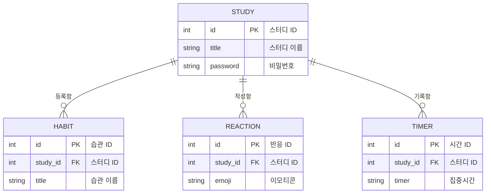

## 페이지별 상세 기능

**1. 홈페이지**

- 헤더
  - 공부의숲로고 표시
  - 스터디만들기 버튼 - 상세페이지(스터디만들기) 이동

- 최근조회한 스터디
  - 최근조회한 스터디 목록 3가지 가로 정렬
  - 클릭시 해당 페이지 이동

- 스터디 둘러보기
  - 검색 기능 구현
  - 정렬기능 구현
  - 스터디 목록 각 화면에 정보 넣기 (제목, 내용, 리액션 이모티콘)
  - 더보기 기능 추가

---

**2. 상세페이지 (스터디만들기)**

- 기본정보 입력창 만들기

- 배경선택 창 만들기
  - 스터디 목록에 적용될 테마 선택 구현

- 비밀번호
  - 비밀번호 설정 및 확인 구현하기

- 만들기버튼
  - 만든 스터디 제출 기능 구현

---

**3. 스터디 상세**

- 헤더
  - 리액션 이모티콘 표시 / 클릭시 +1 개수표기 기능 구현
  - 공유하기 / 수정하기 / 스터디삭제 기능 구현
  - 오늘의습관 / 오늘의집중 페이지 이동 버튼 기능 구현

- 습관 기록표
  - 주단위 습관기록 리스트 기능 구현
  - 발바닥모양 일러스트 시각화
  - 일러스트 클릭시 색상변경 (리스트별 다른 색상)

---

**4. 오늘의 습관**

- 연우의 개발공장
  - 오늘의집중 / 홈 페이지 이동 버튼 기능 구현
  - 현재시간 기능 구현

- 오늘의 습관
  - 습관 목록 리스트 구현
  - 습관 목록 리스트 클릭시 색상변경
  - 목록수정 버튼 기능 구현 
  - 리스트별 삭제 기능 / 리스트 추가 기능
  - 습관없는 빈페이지

---

**5. 오늘의 집중**

- 오늘의 집중
  - 타이머기능 구현 (타이머 시간설정)
  - 스타트버튼 클릭시 타이머시작
  - 멈춤 / 다시하기 버튼 기능 구현
  - 시간 얼마안남으면 빨간색상 적용?

---

## ER 다이어그램

