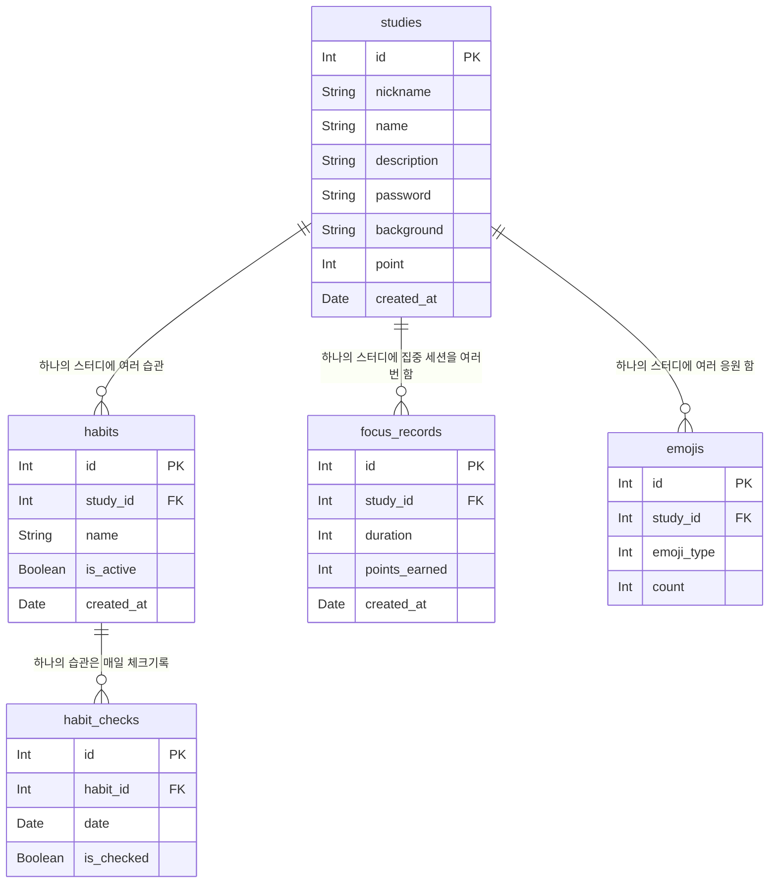

# 🗂 ER Diagram

## 테이블 요약

| 테이블 | 주요 컬럼 |
| --- | --- |
| studies | id, nickname, name, description, password, background, point, created_at |
| habits | id, study_id(FK), name, is_active, created_at |
| habit_checks | id, habit_id(FK), date, is_checked |
| focus_records | id, study_id(FK), duration, points_earned, created_at |
| emojis | id, study_id(FK), emoji_type, count |

## 다이어그램

