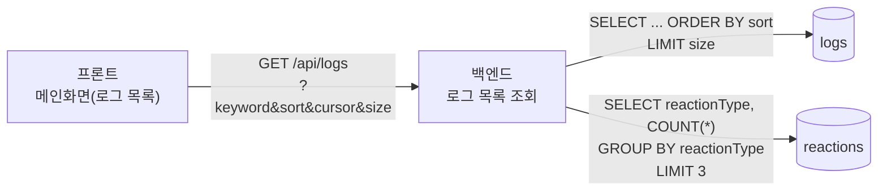
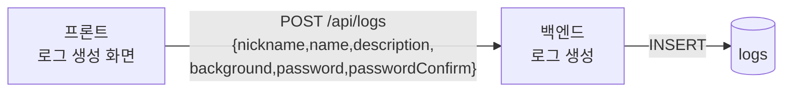
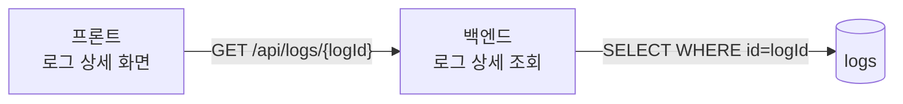
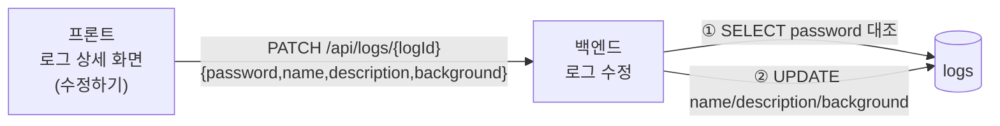
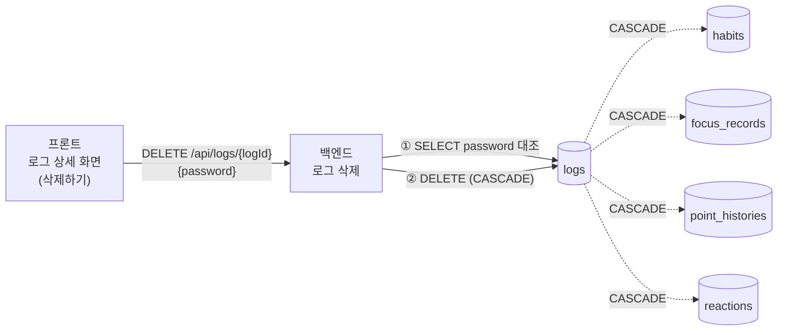
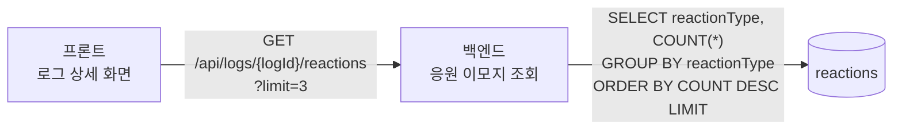
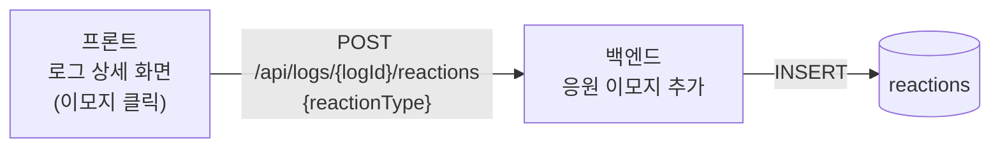
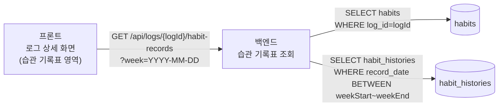

# 로그 API 구조도 (8개)

프론트 → 백엔드 → DB 관계를 API 1개당 다이어그램 1개로 정리했습니다.

---

## 1. 로그 목록 조회

`GET /api/logs`

---

## 2. 로그 생성

`POST /api/logs`

---

## 3. 로그 상세 조회

`GET /api/logs/{logId}`

---

## 4. 로그 수정

`PATCH /api/logs/{logId}`

---

## 5. 로그 삭제

`DELETE /api/logs/{logId}`

---

## 6. 응원 이모지 조회

`GET /api/logs/{logId}/reactions`

---

## 7. 응원 이모지 추가

`POST /api/logs/{logId}/reactions`

---

## 8. 습관 기록표(주간뷰) 조회

`GET /api/logs/{logId}/habit-records`

