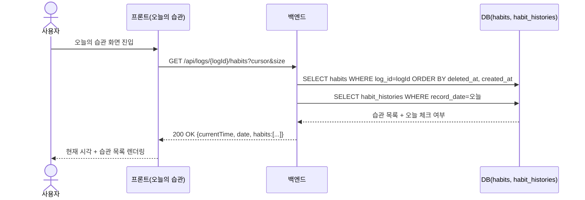
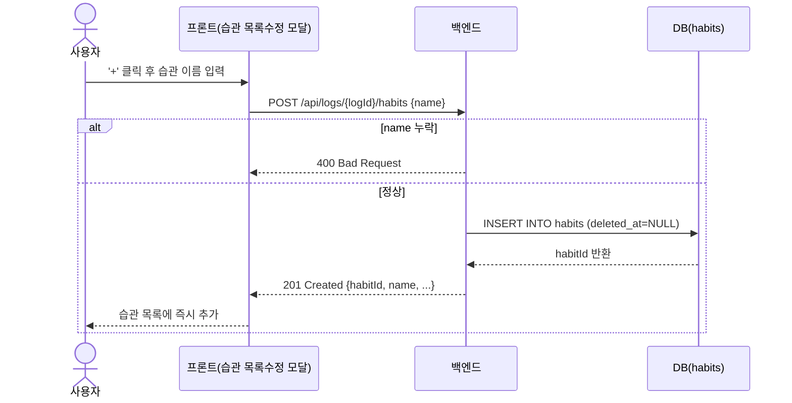
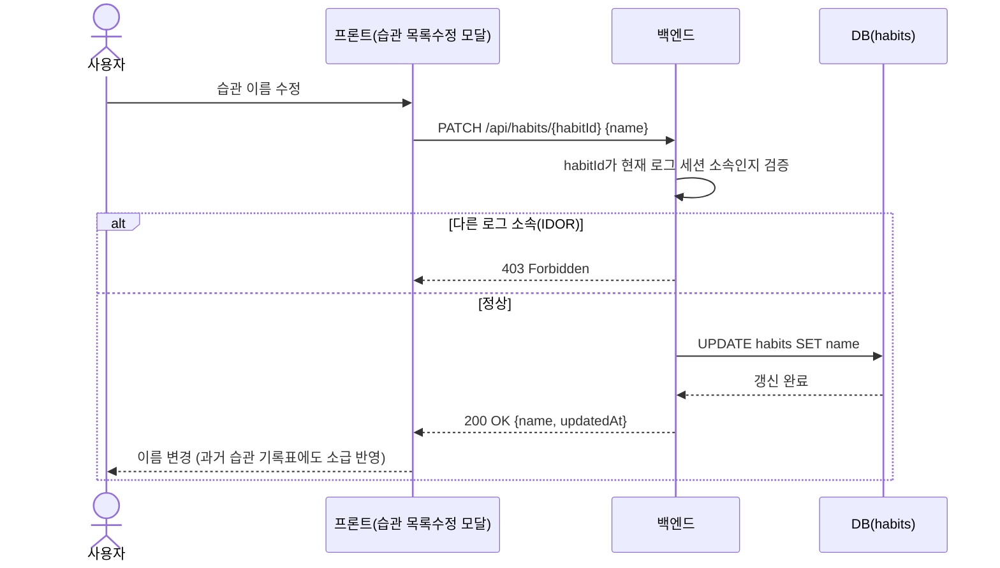
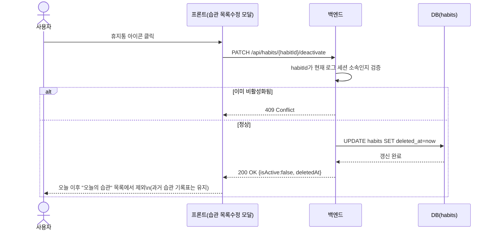
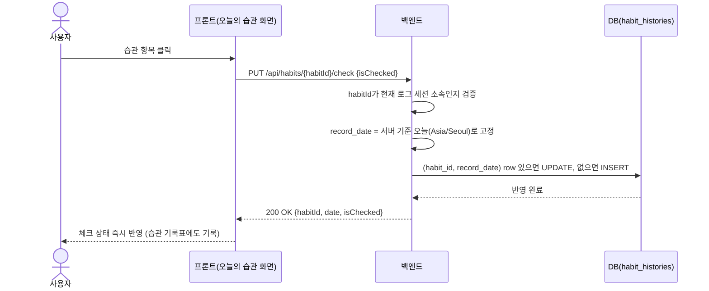

# 오늘의 습관 API 요청 흐름도 (5개)

API 1개당 요청/응답 시퀀스를 1개 다이어그램으로 정리했습니다.

---

## 1. 오늘의 습관 목록 조회

`GET /api/logs/{logId}/habits`

---

## 2. 습관 생성

`POST /api/logs/{logId}/habits`

---

## 3. 습관 이름 수정

`PATCH /api/habits/{habitId}`

---

## 4. 습관 삭제(비활성화)

`PATCH /api/habits/{habitId}/deactivate`

---

## 5. 습관 체크/체크 해제

`PUT /api/habits/{habitId}/check`

