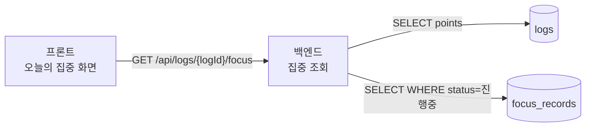
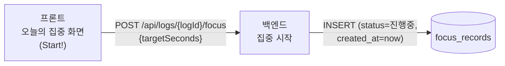
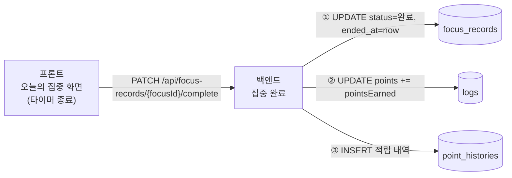

# 오늘의 집중 API 구조도 (3개)

프론트 → 백엔드 → DB 관계를 API 1개당 다이어그램 1개로 정리했습니다.

---

## 1. 오늘의 집중 조회

`GET /api/logs/{logId}/focus`

---

## 2. 오늘의 집중 시작

`POST /api/logs/{logId}/focus`

---

## 3. 오늘의 집중 완료

`PATCH /api/focus-records/{focusId}/complete`

