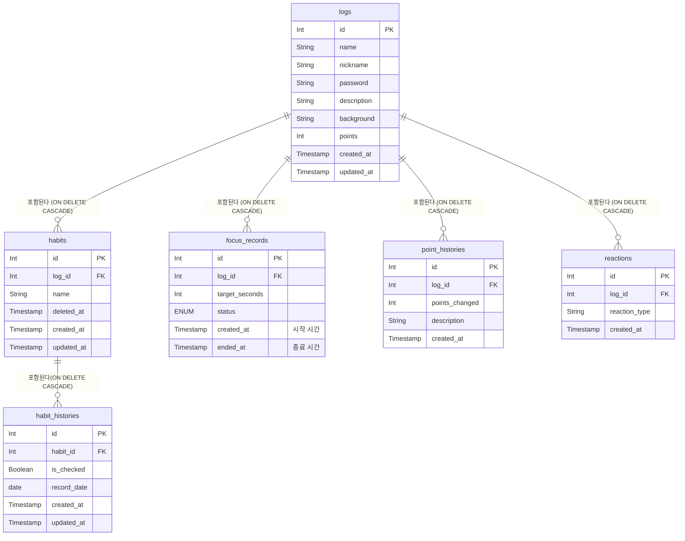

# 🗂 ER Diagram

## 데이터 모델링

### 테이블 요약

| 테이블          | 주요 컬럼                                                                     |
| --------------- | ----------------------------------------------------------------------------- |
| logs            | id,nickname,password,name,description,background,points,created_at,updated_at |
| habits          | id,log_id,name,deleted_at,created_at,updated_at                               |
| habit_histories | id,habit_id,record_date,is_checked,created_at,updated_at                      |
| focus_records   | id,log_id,target_seconds,status,created_at,ended_at                           |
| point_histories | id,log_id,points_changed,description,created_at                               |
| reactions       | id,log_id,reaction_type,created_at                                            |

### 1. logs (로그)

로그 정보와 현재 포인트 잔액을 관리합니다.

| 컬럼명                      | 타입      | PK/FK  | 설명                                 |
| --------------------------- | --------- | ------ | ------------------------------------ |
| `id`                        | INT       | **PK** | 고유 번호                            |
| `nickname`                  | VARCHAR   |        | 생성자 닉네임 (로그인 대용)          |
| `password`                  | VARCHAR   |        | 로그 관리 비밀번호                   |
| `name`                      | VARCHAR   |        | 로그 이름                            |
| `description`               | TEXT      |        | 로그 소개                            |
| `background`                | VARCHAR   |        | 로그 배경 테마 (기본값 설정)         |
| `points`                    | INT       |        | 현재 보유 중인 총 포인트 (기본값: 0) |
| `created_at` / `updated_at` | TIMESTAMP |        | 생성 / 수정 일시                     |

### 2. habits (오늘의 습관)

어떤 습관을 할 것인지 목록을 관리합니다.

| 컬럼명                      | 타입      | PK/FK  | 설명                                                                |
| --------------------------- | --------- | ------ | ------------------------------------------------------------------- |
| `id`                        | INT       | **PK** | 고유 번호                                                           |
| `log_id`                    | INT       | **FK** | 어떤 로그의 습관인지 (`logs`에 참고)                                |
| `name`                      | VARCHAR   |        | 습관 이름 (예:리액트공부하기)                                       |
| `deleted_at`                | TIMESTAMP |        | 삭제 일시 (값이 null이면 정상 노출, 값이 있으면 삭제된 것으로 간주) |
| `created_at` / `updated_at` | TIMESTAMP |        | 생성 / 수정 일시                                                    |

### 3. habit_histories (습관 기록)

매일매일 습관을 체크했는지(완료 여부)를 기록합니다.

| 컬럼명                      | 타입      | PK/FK  | 설명                                                     |
| --------------------------- | --------- | ------ | -------------------------------------------------------- |
| `id`                        | INT       | **PK** | 고유 번호                                                |
| `habit_id`                  | INT       | **FK** | 어떤 습관을 체크한 건지 (`habits` 참조)                  |
| `record_date`               | DATE      |        | 체크한 날짜 (예: '2026-08-31'. 이 날짜로 요일/주차 계산) |
| `is_checked`                | BOOLEAN   |        | 완료 여부 (true/false)                                   |
| `created_at` / `updated_at` | TIMESTAMP |        | 생성 / 수정 일시                                         |

### 4. focus_records (오늘의 집중 기록)

타이머로 측정한 집중 시간 기록입니다.

| 컬럼명           | 타입      | PK/FK  | 설명                                        |
| ---------------- | --------- | ------ | ------------------------------------------- |
| `id`             | INT       | **PK** | 고유 번호                                   |
| `log_id`         | INT       | **FK** | 로그 아이디                                 |
| `target_seconds` | INT       |        | 설정한 목표 시간 (초)                       |
| `status`         | ENUM      |        | 현재 상태 (진행중, 완료, 포기 등)           |
| `created_at`     | TIMESTAMP |        | 시작한 시간 (기록 생성 시 자동 저장)        |
| `ended_at`       | TIMESTAMP |        | 종료(또는 포기)한 시간 (시작 시점엔 비워둠) |

### 5. point_histories (포인트 획득/사용 내역)

포인트가 어떻게 생기고 쓰였는지 기록하는 '통장 거래 내역' 같은 테이블입니다.

| 컬럼명           | 타입      | PK/FK  | 설명                                           |
| ---------------- | --------- | ------ | ---------------------------------------------- |
| `id`             | INT       | **PK** | 고유 번호                                      |
| `log_id`         | INT       | **FK** | 포인트 주체 로그 (`logs`에 참고)               |
| `points_changed` | INT       |        | 변동된 포인트 (획득은 +10, 차감은 -50 등)      |
| `description`    | VARCHAR   |        | 변동 사유 (예: "1시간 집중 달성", "테마 변경") |
| `created_at`     | TIMESTAMP |        | 생성 일시                                      |

### 6. reactions (응원 이모지)

로그에 달린 익명 이모지들입니다.

| 컬럼명          | 타입      | PK/FK  | 설명                               |
| --------------- | --------- | ------ | ---------------------------------- |
| `id`            | INT       | **PK** | 고유 번호                          |
| `log_id`        | INT       | **FK** | 어떤 로그 달렸는지 (`logs`에 참고) |
| `reaction_type` | VARCHAR   |        | 이모지 종류 텍스트 (예: "👍")      |
| `created_at`    | TIMESTAMP |        | 생성 일시                          |

## ER 다이어그램 (테이블 간의 관계)

logs (1) - (N) habits : "하나의 기록에 여러 습관을 등록"
habits (1) - (N) habit_histories : "하나의 습관은 날짜별로 매일 체크기록함"
logs (1) - (N) focus_records : "하나의 기록에 여러번의 집중 기록이 쌓임"
logs (1) - (N) reactions : "하나의 기록에 여러번의 반응을 함"
logs (1) - (N) point_histories : "하나의 기록 여러 포인트기록 쌓음"

### 삭제 정책

- **습관(habits) 단위 삭제**: soft delete(`deleted_at`). 로그가 살아있는 한, 삭제 이전의 habit_histories 기록은 습관 기록표에 계속 보존됨.

### 다이어그램

